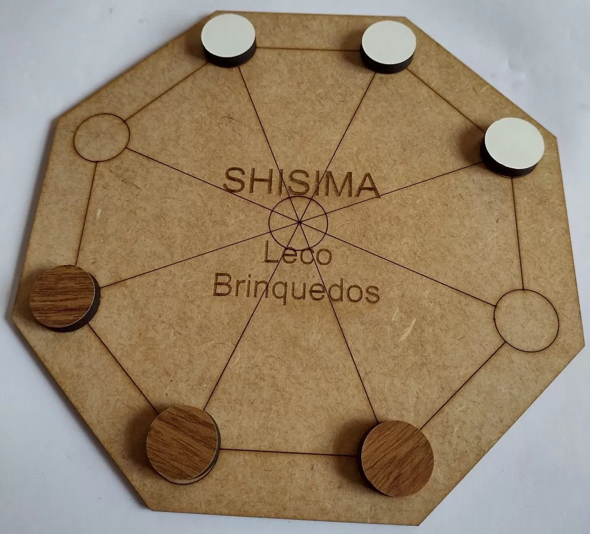

# Shisima 
SSC0511 - Organizacao de Computadores Digitais

Projeto desenvolvido por Luiz Benedito e Murilo Franchi.

# O Shisima
 
Shisima é um jogo de tabuleiro típico do Kenya, jogado por duas pessoas. O modo de jogar é parecido ao famoso "Jogo da Velha", entretanto possui um tabuleiro mais elaborado.

## O Jogo

A partir desta ideia, começamos a montar o código em assembly e recriar o shisima em sua versão gráfica

## Como Jogar?

Utilizando os numeros horizontais do teclado, cada jogador vai poder mover uma peça por turno. Para movimentar a peça, basta escolher o numero de sua posição para uma outra posição válida (marcadas como '0'). Vence aquele que formar uma linha na diagonal, vertical ou horizontal, com suas peças primeiro!

E aí, bora jogar?

